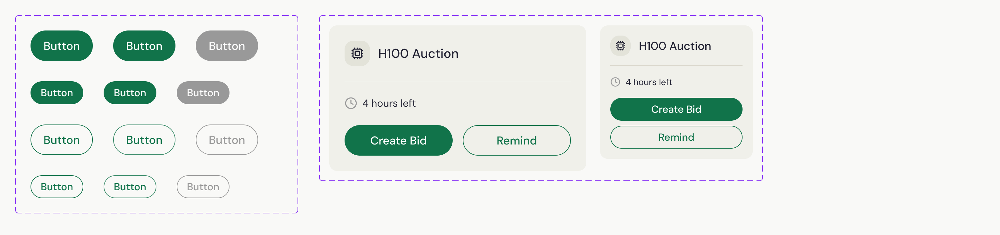

## CX Interview

What this repository contains:

1. NextJS app. Run `pnpm i && pnpm dev` to start the development server
1. TailwindCSS v4 w/ theme defined in `src/app/globals.css`
1. Lucide icons are installed for your convenience
1. Other installed libraries include `tailwind-merge`, `tailwind-variants`, `clsx`, `cva`
1. Font `DM Sans` from Google Fonts is installed for your convenience

What has been implemented:

1. Desktop layout with collapsible sidebar (click on the "Sidebar" text)
1. Mobile layout with header

### Your task: Recreate this mockup in this repository

[Figma file](./public/cx-fe-technical-interview.fig)

**Desktop**


**Mobile**


**Components**



**Colors**


```css
--background: hsl(60 14% 97%);
--on-primary: hsl(0 0 100%);
--outline-light: hsl(49 16% 80%);
--primary: hsl(155 74% 26%);
--surface-container: hsl(60 17% 91%);
--surface-container-high: hsl(60 15% 87%);
--surface-container-low: hsl(60 17% 93%);
--text-em-high: hsl(240 20% 17%);
--text-em-low: hsl(0 0 60%);
--text-em-mid: hsl(0 0 48%);
```

#### Guidelines

- Focus on reusability and ease of maintenance of the codebase
- Talk out loud and explain your thought process
- Use the Figma file to guide your implementation
- Consider all breakpoints (has to be flexible and responsive for ANY screen size)
- Use FE best practices and patterns
- Feel free to install any libraries you think can help you implement the task faster or better while maintaining the code quality
- Feel free to re-organise the codebase to match how a medium scale app would structure its FE codebase. Provided structure are for the purpose of this task only.
- This task should take 20 minutes to complete

### What is being tested on

- FE Architecture
- Code quality
- Design System
- HTML & CSS
- Performance optimisations if any
- Attention to detail
